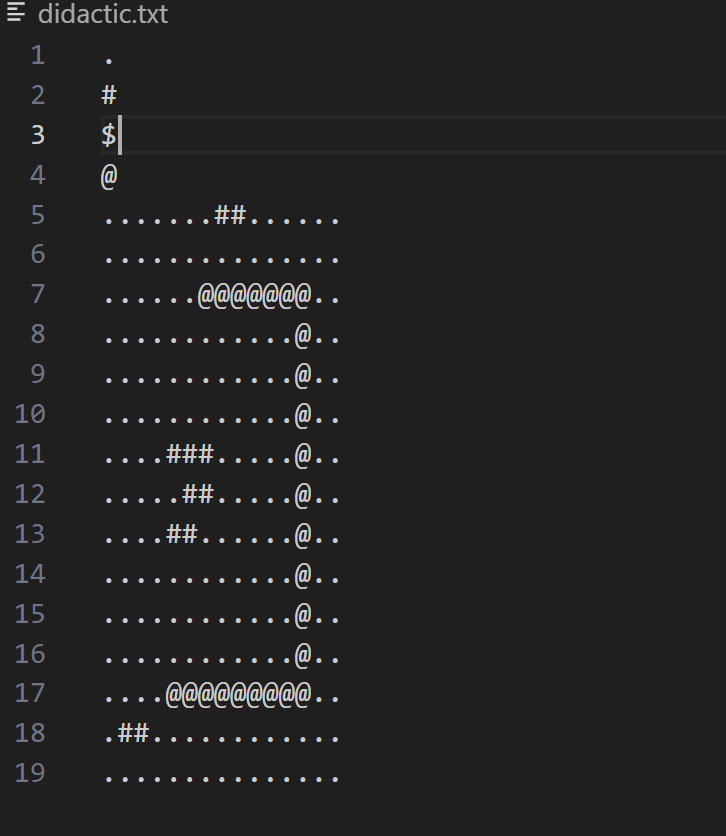
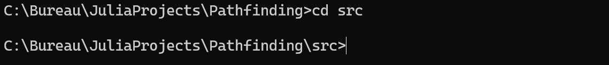
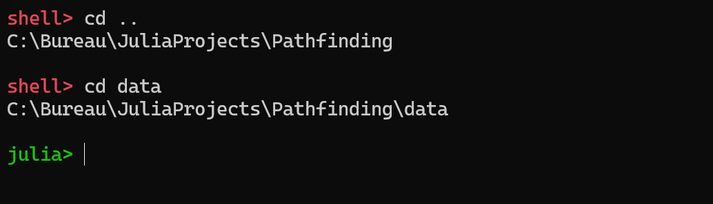
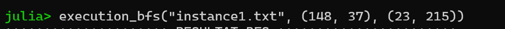
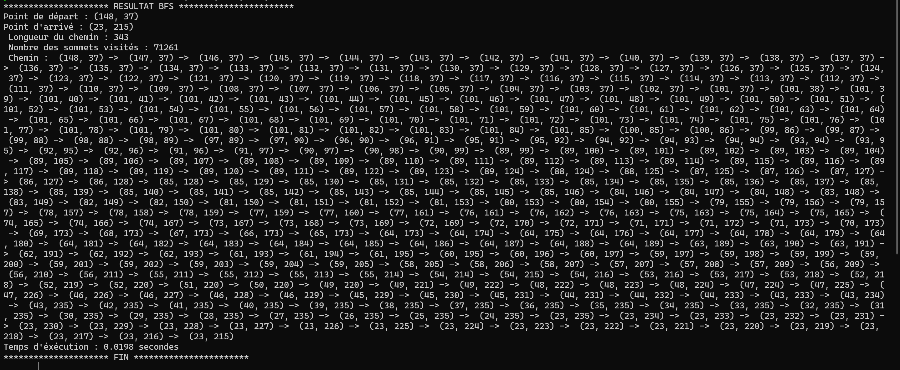

# PRESENTATION DU PROJET
Il s'agit d'un projet sur l'exploration d'un graphe pondéré en cherchant le plus court chemin partant d'un sommet de départ D vers un sommet d'arrivé A. 

# INSTANCES DU PROBLEME
## Graphe : 
Il s'agit d'une matrice à **n lignes** et **m colonnes** où chaque case de la matrice est un sommet du graphe qui possède, en cas d'existance, des **voisins** (sommets adjacents) : la case du dessus (**Nord**), du dessous (**Sud**), de gauche (**Ouest**) et de droite (**Est**).  
## Sommet : 
De plus, un **s** sommet possède une couleur (type Char) correspondant au caractère visitable ou non de celui-ci, mais aussi du coût associé au deplacement partant d'un voisin **v** de **s** vers ce dernier, dans la mesure que celui-ci ne soit pas une case **infranchissable**

# DONNEES D' ENTREE
## Fichier .txt
Le fichier a founir dans l'applle des fonctions d'exécutions d'algorithmes de plus court chemin doivent respecter la structure suivant : 

- Première ligne : le caractère de la couleur visitable sans aucune pénalité
- Deuxième ligne : le caractère de la couleur visitable avec pénalité d'une région sablonneuse (Sinon mettre un caractère qui n'est pas une couleur présente dans le graphe. Exemple : $)
- Troisème ligne : le caractère de la couleur avec pénalité d'une région remplit d'eau (sinon mettre un symbole inexistant dans le graphe)
- Quatrième ligne : caractère de la couleur d'un sommet infranchissable
- Les lignes suivantes sont formées des symboles formant matriciellement les données du graphe (couleur de chaque sommet).

### Exemple du fichier d'entrée

**Remarque :** 
- D'une part, le caractère "$", sur la troisème ligne correspond à la couleur d'un sommet visitable mais pénalisant puisqu'il s'agit d'une région remplit d'eau. Toutefois, ce symbole n'est pas utilisé dans le graphe.
- D'autre part : 
    - la couleur d'un sommet visitable sans pénalité est "."
    - celle d'une pénalité dû au sable est "#"
    - un sommet infranchissable est encodé par le symbole "@"
- Les lignes restantes correspondent au graphe qui sera construit par la suite

# EXECUTION DU  PROGRAMME

## Les fonctions des algorithmes de plus court chemin : 
les algrorithmes de recherche de plus court chemin partant d'un sommet de départ D vers un sommet d'arrivée A s'effectue de la manière suivante :   **fonction("nom_instance.txt", (x,y), (v,w))**

Ici : 
1. *"fonction"* sera le nom de l'algorithme de plus court chemin selectionné parmi ceux qui seront présentés ci-après
2. *"nom_instance.txt"* correspondra au fichier texte conforme aux exigences présentées précédemment
3. **(x,y)** seront les coordonnées du sommet de départ avec **x** et **y** des entiers
4. **(v,w)** représenteront les coordonnées du sommet d'arrivée avec **v** et **w** des entiers

## Les noms algorithmes de plus court chemins : 
- **execution_bfs( )**
- **execution_dijkstra( )**
- **execution_a_star( )**
- **execution_glouton( )**

# EXEMPLE D'EXECUTION ET DU RESULTAT
## Chargement du fichier : 
Une fois dans le répertoire **Pathfinding**, par la commande : **cd src**, se rendre dans le répertoire *src* contenant le fichier du programme, dénommé **"pathfinding.jl"**.  
 Dans le **REPL** de Julia, le chargement du fichier s'effectue par la commande : **include("pathfinding.jl")**

## Répertoire des données d'entrées : 
Par la suite, entrer en **Shell Mode** avec la touche du clavier **" ; "** pour se rendre dans le répertoire parent *Pathfinding* par la commande : **cd ..** , puis rendre dans le répertoire *data* contenant les données d'entrées, avec la commande : **cd data**.
Enfin, revenir en mode **prompt Julia** avec la touche du clavier : *Backspace*.

## Exécution : 

## Résultat : 
Le résultat comprend : 
- Le point de départ **D**
- Le point d'arrivée **A**
- La longueur totale du chemin (coût)
- Le nombre des sommets visités durant la recherche du chemin
- Le chemin trouvé
- Le temps d'éxécution **(secondes)**

En voici une illustration : 

