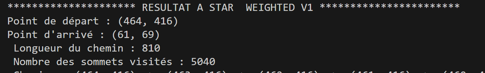

# ETUDE COMPARATIVE DES ALGORITHMES A*

## Situation : instance3.txt
### Départ (464, 416) 
### Arrivé (61, 69)

### A* sans pondération

**Résultats** :
- Longueur du chemin : **757**
- Sommets visités : **40 922**

### A * (pondéré) version  1 :   ***f(n) = w \* g(n) + (1-w)\*h(n) , avec  0 < w < 1***

1. ***w = 0.2*** (proche de 0 : approche gloutone)

**Résultats** : 
    - Longueur du chemin : **1 134**
    - Sommets visités : **7 463**

2. ***w = 0.5*** ( équilibre entre le coût réel et l'heuristique)

**Résultats** : 
    - Longueur du chemin : **757**
    - Sommets visités : **39 861**

1. ***w = 0.8*** (proche de 1 : prudence de Dijkstra)

**Résultats** : 
    - Longueur du chemin : **757**
    - Sommets visités : **164 174**

### A* (pondéré) version 2 : ***f(n) = g(n) + w \* h(n) , avec w > 1***
1. ***w = 1.3*** (proche de 1 : acceptable (vitesse et optimalité du chemin))

**Résultats** : 
    - Longueur du chemin : **771** 
    - Sommets visités :  **4 875**

2. ***w = 1.7*** (proche de 2 : peu optimal mais meilleur que la *version 1* avec ***w*** proche de **0**)

**Résultats** : 
    - Longueur du chemin : **810**
    - Sommets visités :  **5040**

3. ***w = 2.5*** (approche gloutone et sous-optimalité du chemin)

**Résultats** : 
    - Longueur du chemin : **1 016**
    - Sommets visités :  **7 7792**

### A* (pondéré) version 3 : ***f(n) = g(n) + w \* h(n) , avec w > 1 dynamique***

#### *fonction d'ajustement de* ***w***

#### *fonction du sondage des voisins visitables*

#### *fonction du sondage des voisins visitables au niveau 2*

**Résultats** : 

    - Longueur du chemin : **874** 
    - Sommets visités :  **13 725**

**Tolérable!**

