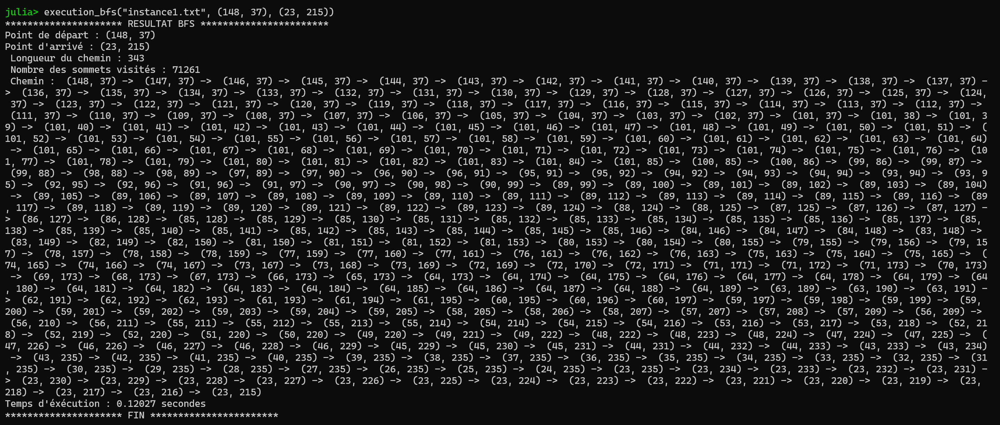
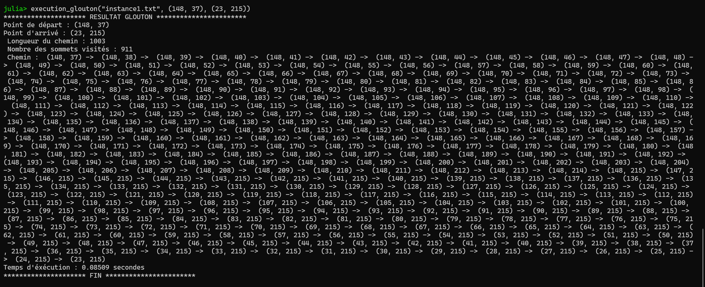
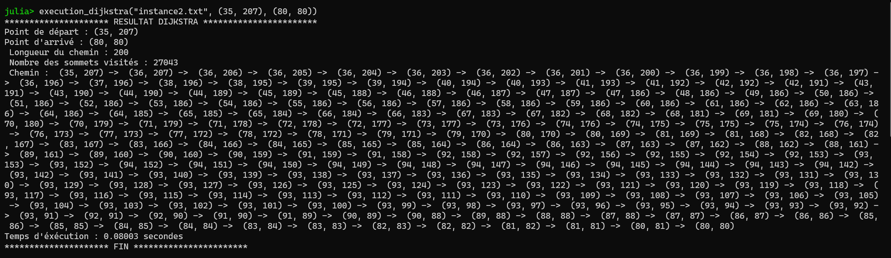
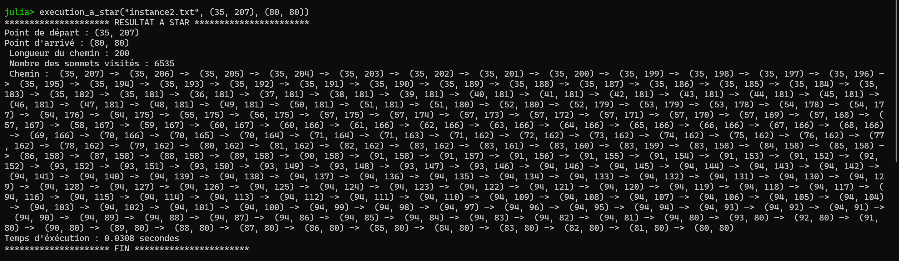
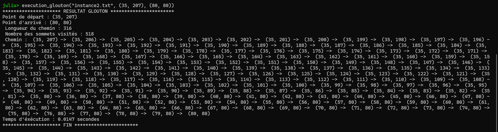
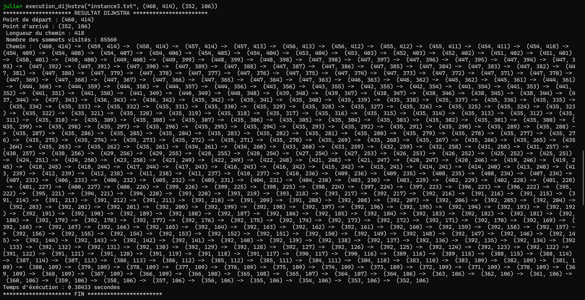
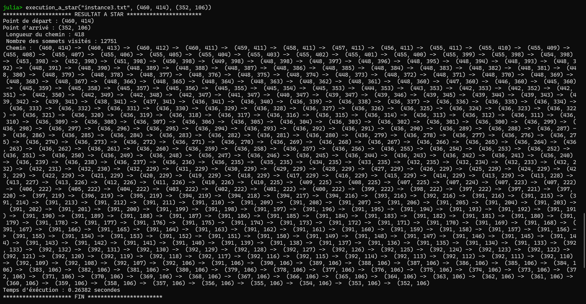
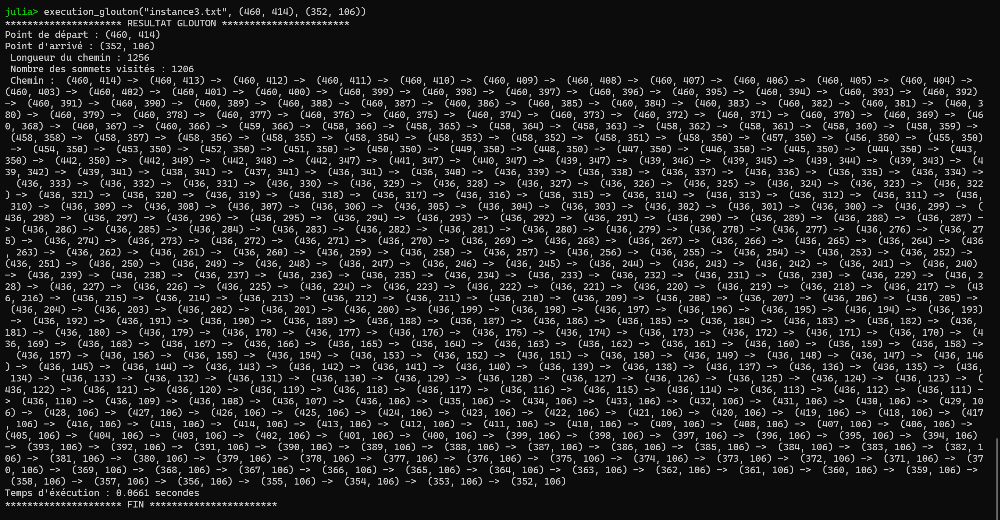

# ETUDE COMPARATIVE DES ALGORITHMES DE PATHFINDING 
## *instance1.txt* sans aucune pénalité 
### sommet de départ : (148, 37) &  sommet d'arrivée : (23, 215)
#### Breadth-First-Search vs Greedy (Glouton)
#### BFS

#### Glouton

##### Analyse :
Il est indéniable que l'***algorithme glouton*** est avantagieux dans la vitesse d'exécution, soit **85** millièmes de secondes contrairement à ***BFS*** , **120** millièmes de secondes.  
De plus, l'*algorithme glouton* explore le moins de sommets possible comparé à *BFS*, plus de **75 fois moins** .

Toutefois, l'*algorithme BFS* est avantagieux au regard de la longueur du chemin qui est de **343**, presque **3 fois plus** court que celui trouvé par l'algorithme *glouton* .

## instance2.txt avec pénalité du sable
### sommet de départ : (35, 207) &  sommet d'arrivée : (80, 80)
#### Dijkstra vs A star vs Greedy
#### Dijkstra

#### A star

#### Glouton

##### Analyse :
Nonobstant l'égalité de la longueur du chemin, l'*algorithme A star* reste meilleur que *Dijkstra* en temps d'exécution, au moins **deux fois plus** rapide. Mais aussi, le nombre des sommets visités **4 fois moins** important comparé à l'*algotithme Dikjstra*. 

Enfin, l'*algorithme Glouton* est exécuté **3 fois plus** rapidement que *A star* et **8 fois plus**, comparé à *Dijkstra*. Cependant, le chemin trouvé par *Glouton* n'est pas optimisé au sens de la minimisation de la distance, puisque que ce chemin trouvé est **50 pourcent plus** long, c'est-à-dire de longueur **316**, contrairement aux algorithmes *A star et Dijkstra* qui trouvent des chemins de longueur **200**  
Des observations similaires, à proportion près, peuvent être faites pour les instances ayant les deux pénalités, du sable et de l'eau, comme dans les images ci-dessous.

## instance3.txt avec pénalités de l'eau et du sable
### sommet de départ : (460, 414) &  sommet d'arrivée : (352, 106)

#### Dijkstra

#### A star

#### Glouton
